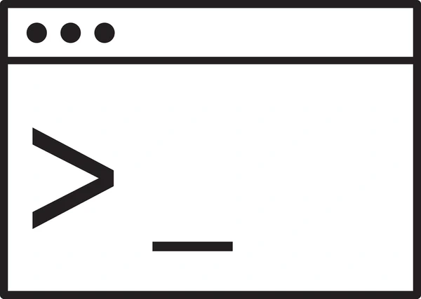

#  Linux-lessons 

## Index 🐧

<table style="border-collapse: collapse; border: none;">
  <tr>
    <td style="vertical-align: top; text-align: left; border: none;">
<!-- INDICE -->
 - <a href="link">Básicos</a><br>
&nbsp;&nbsp;&nbsp;&nbsp; - <a href="link">Sitema de Arquivos</a><br>
&nbsp;&nbsp;&nbsp;&nbsp; - <a href="link">Listar Arquivos</a><br>
&nbsp;&nbsp;&nbsp;&nbsp; - <a href="link">Permissões</a><br>
 - <a href="link">Partições</a><br>
&nbsp;&nbsp;&nbsp;&nbsp; - <a href="link">Ver Partições</a><br>
&nbsp;&nbsp;&nbsp;&nbsp;&nbsp;&nbsp;&nbsp;&nbsp; - <a href="link">1. Usando o comando lsblk</a><br>
&nbsp;&nbsp;&nbsp;&nbsp;&nbsp;&nbsp;&nbsp;&nbsp; - <a href="link">2. Usando o comando fdisk</a><br>
&nbsp;&nbsp;&nbsp;&nbsp;&nbsp;&nbsp;&nbsp;&nbsp; - <a href="link">3. Usando o comando df</a><br>
&nbsp;&nbsp;&nbsp;&nbsp;&nbsp;&nbsp;&nbsp;&nbsp; - <a href="link">4. Usando o parted</a><br>
&nbsp;&nbsp;&nbsp;&nbsp;&nbsp;&nbsp;&nbsp;&nbsp; - <a href="link">5. Com GUI (Se você prefere interface gráfica)</a><br>
&nbsp;&nbsp;&nbsp;&nbsp;&nbsp;&nbsp;&nbsp;&nbsp;&nbsp;&nbsp;&nbsp;&nbsp; - <a href="link">GParted</a><br>
&nbsp;&nbsp;&nbsp;&nbsp;&nbsp;&nbsp;&nbsp;&nbsp;&nbsp;&nbsp;&nbsp;&nbsp; - <a href="link">Discos (gnome-disks)</a><br>
&nbsp;&nbsp;&nbsp;&nbsp; - <a href="link">Montar Partição</a><br>
&nbsp;&nbsp;&nbsp;&nbsp;&nbsp;&nbsp;&nbsp;&nbsp; - <a href="link">Montar a Partição (Caso Não Esteja Montada)</a><br>
 - <a href="link">Criar programas Personalizados</a><br>
&nbsp;&nbsp;&nbsp;&nbsp; - <a href="link">Cuidado com o interpretador</a><br>
 - <a href="link">Verificar origem do programa</a><br>
&nbsp;&nbsp;&nbsp;&nbsp; - <a href="link">ir para esse repo</a><br>
 - <a href="link">Redirecionamento e pipes</a><br>
&nbsp;&nbsp;&nbsp;&nbsp; - <a href="link">Redirecionando a saída para um arquivo</a><br>
&nbsp;&nbsp;&nbsp;&nbsp; - <a href="link">Pipes</a><br>
 - <a href="link">Variáveis</a><br>
 - <a href="link">Scripts Bash</a><br>
&nbsp;&nbsp;&nbsp;&nbsp; - <a href="link">Variaveis</a><br>
&nbsp;&nbsp;&nbsp;&nbsp; - <a href="link">Operações</a><br>
&nbsp;&nbsp;&nbsp;&nbsp; - <a href="link">If-else</a><br>
&nbsp;&nbsp;&nbsp;&nbsp; - <a href="link">Operador Lógico</a><br>
&nbsp;&nbsp;&nbsp;&nbsp; - <a href="link">Loop usando o For</a><br>
&nbsp;&nbsp;&nbsp;&nbsp; - <a href="link">Loop usando o While</a><br>
&nbsp;&nbsp;&nbsp;&nbsp; - <a href="link">Funções</a><br>
&nbsp;&nbsp;&nbsp;&nbsp; - <a href="link">Input</a><br>
&nbsp;&nbsp;&nbsp;&nbsp; - <a href="link">Pipe</a><br>
&nbsp;&nbsp;&nbsp;&nbsp; - <a href="link">Manipulando Arquivos</a><br>
   </td>
    <td style="vertical-align: top; border: none;">
      
    </td>
  </tr>
</table>

# Básicos
## Sitema de Arquivos 
File Hierarchy Standard (FHS)

| Path     | Content                             |
| -------- | ----------------------------------- |
| `/bin`   | Binaries (User)                     |
| `/boot`  | Static boot loader files            |
| `/etc`   | Host specific configs               |
| `/lib`   | Shared libraries and kernel modules |
| `/sbin`  | Binaries (System/root)              |
| `/var`   | Varying files (e.g. Logs)           |
| `/usr`   | 3rd party software                  |
| `/proc`  | Pseudo file system                  |
| `/sys`   | Pseudo file system                  |
| `/mnt`   | Mountpoint for internal drives      |
| `/media` | Mountpoint for external drives      |
| `/home`  | User homes                          |
| `/run`   | PID files of running processes      |

---

Aqui estão alguns comandos básicos que você vai usar frequentemente:

ls: Lista arquivos e diretórios no diretório atual.
    Exemplo: ls ou ls -l (para listar detalhes).
cd: Muda o diretório de trabalho.
    Exemplo: cd /home/usuario ou cd .. (para voltar um diretório).
pwd: Mostra o diretório atual em que você está.
    Exemplo: pwd.
touch: Cria um novo arquivo vazio.
    Exemplo: touch novo_arquivo.txt.
mkdir: Cria um novo diretório.
    Exemplo: mkdir novo_diretorio.
rm: Remove arquivos ou diretórios.
    Exemplo: rm arquivo.txt ou rm -r diretorio (para remover diretórios).
cp: Copia arquivos ou diretórios.
    Exemplo: cp arquivo.txt copia_arquivo.txt.
mv: Move ou renomeia arquivos e diretórios.
    Exemplo: mv arquivo.txt novo_diretorio/ ou mv arquivo.txt novo_nome.txt.

## Listar Arquivos
ls -l /usr/local/bin/token
Isso mostrará as permissões

## Permissões
sudo chmod +x /usr/local/bin/token -> executável por todos os usuários
Se você quiser que apenas você possa executá-lo, ajuste as permissões para o seu usuário:
sudo chown $(whoami):$(whoami) <arquivo>
sudo chmod 755 <arquivo>
Ou, se você só precisa que o arquivo seja executável pelo seu usuário:

sudo chmod u+x /usr/local/bin/token


# Partições 
## Ver Partições 
### 1. Usando o comando lsblk
Mostra informações sobre os discos e partições de forma hierárquica:
```bash
lsblk
```
Se quiser ver com detalhes adicionais, como os pontos de montagem e tamanhos:

```bash
lsblk -f

```
### 2. Usando o comando fdisk
Para listar as partições de um disco específico (substitua /dev/sdX pelo seu disco):

```bash
sudo fdisk -l
```
Exemplo: 
```bash
sudo fdisk -l /dev/sda
```
### 3. Usando o comando df
Se você deseja visualizar apenas partições montadas:

```bash
df -h
```
### 4. Usando o parted
Para uma visão mais detalhada e interativa das partições:

```bash
sudo parted /dev/sdX
```
No terminal interativo, você pode usar o comando print para listar as partições.

### 5. Com GUI (Se você prefere interface gráfica)
Se você está em um ambiente gráfico, pode usar ferramentas como:

#### GParted:
Instale com:

```bash
sudo apt install gparted
```
E execute:
```bash
sudo gparted
```
#### Discos (gnome-disks):
Em distribuições baseadas no GNOME, pode abrir diretamente o aplicativo "Discos".

## Montar Partição

### Montar a Partição (Caso Não Esteja Montada)
Se por algum motivo a partição não estiver montada, você precisará montá-la manualmente. Para isso:

Verifique o ponto de montagem desejado ou crie um diretório para isso:

```bash
sudo mkdir -p /mnt/Dados
```
(-p -> cria os diretorios e subdiretorios se necessário)
Monte a partição:

```bash
sudo mount /dev/nvme0n1p9 /mnt/Dados
```
Verifique se foi montada corretamente:

```bash
df -h
```

----> OBS : Permissões
Se você tiver problemas de permissão ao acessar os arquivos, pode ajustar com:

```bash
sudo chmod -R 777 /mnt/Dados
```
Ou tornar-se o usuário root temporariamente:

```bash
sudo su
cd /mnt/Dados
```


# Criar programas Personalizados
Local do executavel : /usr/local/bin
exemplo : /usr/local/bin/traduz


Suponha que você tenha um arquivo chamado meu_programa.c. Você pode compilar este arquivo usando gcc (GNU Compiler Collection):

```sh
gcc meu_programa.c -o meu_programa
```

Mover o executável para /usr/local/bin (requer permissão de superusuário):

```sh
sudo mv meu_programa /usr/local/bin/
```

Mover o executável para ~/bin (não requer permissão de superusuário):

```sh
mv meu_programa ~/bin/
```


Nota: Para garantir que ~/bin esteja no seu PATH, você pode adicionar a seguinte linha ao seu arquivo .bashrc ou .profile:

```sh
export PATH=$HOME/bin:$PATH
```
E depois recarregar o arquivo:

```sh
source ~/.bashrc  # ou source ~/.profile
```
Após esses passos, você deve ser capaz de executar o seu programa de qualquer lugar no terminal digitando meu_programa.
## Cuidado com o interpretador
Certifique-se de que o script x tenha o shebang correto na primeira linha para garantir que ele seja executado pelo interpretador correto. Por exemplo, para um script Bash, a primeira linha deve ser: _#!/bin/bash_ ou _#!/usr/bin/env bash_
# Verificar origem do programa 
Para descobrir exatamente onde o script está localizado, você pode usar o comando which:

```sh
which <codigo>
```
Exemplo :

```sh
which python
which <comando criado >
which nmp
which cd
```
## ir para esse repo 
```bash
cd $(dirname $(which token))
```
Explicação do comando:

- which token: Isso retorna o caminho completo do seu script token.
- dirname $(which token): Isso extrai o diretório do caminho completo retornado pelo which token.
- cd $(dirname $(which token)): Isso muda o diretório para o diretório onde o script token está localizado.


# Redirecionamento e pipes
Bash permite redirecionar a saída de comandos para arquivos ou até mesmo usá-los em conjunto com outros comandos através de pipes (|).

## Redirecionando a saída para um arquivo:

echo "texto" > arquivo.txt: Cria (ou substitui) um arquivo com o texto.
echo "texto" >> arquivo.txt: Adiciona ao final de um arquivo existente.
## Pipes:

ls | grep "documento": Lista arquivos e filtra com grep para mostrar apenas os que contêm "documento".

# Variáveis
Você pode criar variáveis para armazenar dados.

Definindo uma variável:
nome="João"
Usando a variável:
echo $nome: Exibe o conteúdo da variável.


# Scripts Bash 

<table style="border-collapse: collapse; border: none;">
  <tr>
    <td style="vertical-align: top; text-align: justify; border: none;">
    1. O que é Bash?
    Bash (Bourne Again Shell) é um interpretador de comandos usado em sistemas Unix, como Linux e macOS. Ele permite que você execute comandos para interagir com o sistema operacional de maneira eficiente. É importante deixar o arquivo .sh executável.
    No Linux, cada arquivo tem permissões de leitura, gravação e execução, que podem ser ajustadas com o comando chmod.<br>
      chmod +x script.sh: Torna o arquivo executável.<br>
      chmod 755 arquivo.txt: Define permissões para o dono do arquivo, grupo e outros.
      <br>
      Todo script começa com a linha "#!/bin/bash", que indica o interpretador do script. Isso é chamado de "shebang".
    </td>
    <td style="vertical-align: top; border: none;">
      
    </td>
  </tr>
</table>


```bash
#!/bin/bash
echo "Olá, Mundo!" # retorna olá mundo
```

Tornando o Script Executável

```bash
chmod +x meu_script.sh
```

Executando o Script

Para rodar o script, basta usar:

```bash
./meu_script.sh
```

## Variaveis 

```bash

#!/bin/bash
nome="João"
echo "Olá, $nome!"
## If-Else:
```

## Operações 

```bash

#!/bin/bash
a=10
b=5
soma=$((a + b))
echo "A soma de $a e $b é $soma"
```

## If-else

```bash
if [ $nome == "João" ]; then
  echo "Olá João!"
else
  echo "Olá, estranho!"
fi

###################################
#!/bin/bash
idade=20

if [ $idade -ge 18 ]; then
  echo "Você é maior de idade."
else
  echo "Você é menor de idade."
fi


```

## Operador Lógico

```bash
#!/bin/bash
nome="João"
idade=22

if [ $nome == "João" ] && [ $idade -ge 18 ]; then
  echo "Você é o João e é maior de idade!"
fi

```

## Loop usando o For:

```bash
for i in {1..5}; do
  echo "Número $i"
done
```
## Loop usando o While:

```bash
i=1
while [ $i -le 5 ]; do
  echo "Número $i"
  ((i++))
done
```

## Funções
```bash
funcao_ola() {
  echo "Olá, $1!"
}
funcao_ola "Maria"

###############################
#!/bin/bash
saudacao() {
  echo "Olá, $1!"
}

saudacao "Maria"
saudacao "João"

```
O $1 representa o primeiro argumento passado para a função. Você pode passar múltiplos parâmetros para funções, como $2, $3, etc.

## Input
```bash
#!/bin/bash
echo "Qual é o seu nome?"
read nome
echo "Olá, $nome!"
```
## Pipe
Você pode redirecionar a saída de um comando para um arquivo ou passar a saída de um comando para outro comando.

Redirecionando saída para um arquivo:

```bash
#!/bin/bash
echo "Isso será gravado em um arquivo" > arquivo.txt
```

Usando pipes (|): O comando grep pode ser combinado com outros comandos para filtrar a saída.

```bash
#!/bin/bash
ls | grep "documento"
```
## Manipulando Arquivos
Você pode criar, ler, escrever e manipular arquivos dentro de um script.

Criando e escrevendo em um arquivo:

```bash
#!/bin/bash
echo "Este é um arquivo de texto" > arquivo.txt
```
Lendo um arquivo linha por linha:

```bash
#!/bin/bash
while IFS= read -r linha; do
  echo $linha
done < arquivo.txt
```
